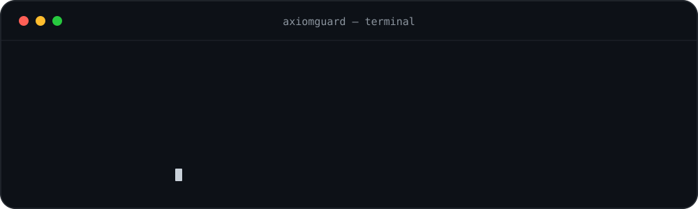

# AxiomGuard

Security building blocks for Node.js and TypeScript services.

[](https://www.npmjs.com/package/@axiomnode-lab/guard)
[](https://nodejs.org/)
[](LICENSE)

<p align="center">
  
</p>

AxiomGuard is a modular security toolkit for backend services. It provides small, typed primitives for request protection, signed webhooks, idempotency, outbound HTTP, rate limiting, secrets handling, environment validation, filesystem safety, and repository secret scanning.

**Status:** pre-1.0.

## Install

Requires Node.js 20 or newer and TypeScript 5.x.

```bash
npm install @axiomnode-lab/guard
```

pnpm and Yarn are also supported:

```bash
pnpm add @axiomnode-lab/guard
yarn add @axiomnode-lab/guard
```

## Quick start

### Express

```ts
import express from 'express';
import { createExpressSecurityMiddleware } from '@axiomnode-lab/guard/adapters/express';

const app = express();

app.use(createExpressSecurityMiddleware({
  cors: {
    origins: ['https://app.example.com'],
    allowCredentials: true,
    allowMethods: ['GET', 'POST', 'PATCH'],
  },
  requestPolicy: {
    allowedOrigins: ['https://app.example.com'],
  },
}));

app.get('/health', (_req, res) => {
  res.json({ ok: true });
});

app.listen(3000);
```

The same security core has adapters for Fastify, Hono, and web-standard Fetch runtimes.

See [Framework adapters](docs/ADAPTERS.md).

### Guard an outbound request

```ts
import { safeFetch } from '@axiomnode-lab/guard/fetch';

const response = await safeFetch(userSuppliedUrl, {
  protocols: ['https:'],
  allowedHosts: ['api.example.com'],
  maxRedirects: 2,
  timeoutMs: 5_000,
  maxResponseBytes: 5_000_000,
});

const data = await response.json();
```

`safeFetch` validates the initial destination and followed redirects, limits redirects and response size, and removes sensitive headers on cross-origin redirects by default.

It does not replace network egress controls or eliminate DNS rebinding risk. See [Safe Fetch](docs/SAFE_FETCH.md).

### Verify a webhook

Always verify a provider signature against the exact raw request body.

```ts
import {
  MemoryReplayStore,
  verifyGitHubWebhookDelivery,
} from '@axiomnode-lab/guard/webhooks';

const replayStore = new MemoryReplayStore();

const result = await verifyGitHubWebhookDelivery(
  rawBody,
  request.headers['x-hub-signature-256'],
  process.env.GITHUB_WEBHOOK_SECRET!,
  request.headers['x-github-delivery'],
  { replayStore },
);

if (!result.ok) {
  throw new Error(`Rejected webhook: ${result.reason}`);
}
```

Provider helpers are available for GitHub, Stripe, Slack, Meta/WhatsApp, and Standard Webhooks.

## Modules

| Module | Purpose |
| --- | --- |
| `api-keys` | Generate and verify high-entropy API keys |
| `webhooks` | Verify signed provider webhooks with optional replay protection |
| `request-policy` | Filter unsafe browser requests using Fetch Metadata and Origin |
| `idempotency` | Claim and validate idempotency keys |
| `fetch` / `web` | Validate URLs and guard outbound fetches |
| `rate-limit` | Fixed-window rate limiting with memory and Redis stores |
| `cors` / `csrf` | Browser request and CSRF controls |
| `headers` / `cookies` | Security headers and cookie serialization |
| `env` | Typed environment validation |
| `logging` | Secret redaction and best-effort PII masking |
| `filesystem` | Safe paths and filenames |
| `scanner` | Repository secret scanning with SARIF and baselines |
| `adapters/*` | Express, Fastify, Hono, Fetch, and Redis integrations |

The root package re-exports the public API, and each module is also available through a focused subpath.

## Repository scanner

Install the package and run:

```bash
npx axiomguard scan .
```

Useful output formats:

```bash
npx axiomguard scan . --json
npx axiomguard scan . --sarif --output axiomguard.sarif
npx axiomguard scan . --write-baseline .axiomguard-baseline.json
```

The scanner reports finding locations and non-secret fingerprints. It does not print detected credential values.

See [Scanner documentation](docs/SCANNER.md).

## GitHub Action

AxiomGuard can scan a checked-out repository in GitHub Actions and produce SARIF:

```yaml
- uses: AxiomNode-lab/AxiomGuard@v0.7.1
  with:
    path: .
    fail-on-findings: 'true'
```

Pin a release tag or commit SHA in production. See [GitHub Action documentation](docs/GITHUB_ACTION.md).

## Security boundaries

AxiomGuard provides application-level security primitives. It does not replace:

- authentication or authorization;
- a secrets manager;
- password hashing;
- network egress controls;
- dependency or container vulnerability scanning;
- application-specific threat modeling;
- durable storage for application responses or transactions.

Security-sensitive behaviour and known limitations are documented in [SECURITY.md](SECURITY.md) and [THREAT_MODEL.md](THREAT_MODEL.md).

## Supported environments

- Node.js 20, 22, and 24
- Linux, macOS, and Windows
- TypeScript 5.x
- Express, Fastify, Hono, and web-standard Fetch runtimes

The package is an ES module. See the package metadata and [API reference](docs/API.md) for supported entry points.

## Documentation

- [API reference](docs/API.md)
- [Framework adapters](docs/ADAPTERS.md)
- [API protection](docs/API_PROTECTION.md)
- [Safe Fetch](docs/SAFE_FETCH.md)
- [Scanner](docs/SCANNER.md)
- [GitHub Action](docs/GITHUB_ACTION.md)
- [Comparison](docs/COMPARISON.md)
- [Threat model](THREAT_MODEL.md)
- [Security policy](SECURITY.md)
- [Upgrading](UPGRADING.md)
- [Changelog](CHANGELOG.md)

## Development

```bash
npm ci
npm run check
```

Useful commands:

```bash
npm test
npm run test:types
npm run test:package
npm run test:coverage
npm run scan:self
```

See [CONTRIBUTING.md](CONTRIBUTING.md) before opening a pull request.

## License

MIT. See [LICENSE](LICENSE).
